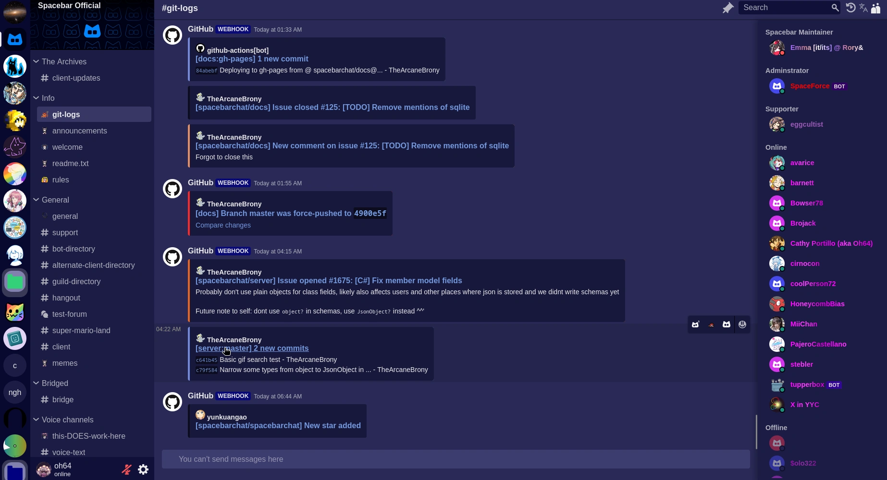

# Fermo

Fermo is a [Spacebar](https://spacebar.chat) Client written in TS, HTML, and CSS.

To build it, clone the repo and run `npm install`, then `npm run build`
To run it, use `npm start`
or do the equivalent with bun.

Both [Bun](https://bun.sh) and [Node.js](https://nodejs.org) are supported, and should function as expected.

To access Fermo after starting, simply go to http://localhost:8080/login and either register a new account, or log in with your email and password.

If there are any issues please report them either here, or to me dirrectly on spacebar

## Adding instances to the dropdown

Fermo use the spacebar explorer instance list to the dropdown picker.
https://git.sovrahi.com/oh64/spacebar-explorer

## How to statically host Fermo

[Click here](./howToStaticallyHost.md)

## AI Code

AI code due to not being GPLv3 compatable is not allowed in this repo. I thought this didn't need to be said, but it does.
And to be clear, _any_ use of AI is not allowed in Fermo.

## Link

The official Spacebar server for Fermo: https://sovr.fyi/i/WYbNha?instance=https%3A%2F%2Fspacebar.chat

The current hosted instance of Fermo: https://fermo.sovr.fyi/
